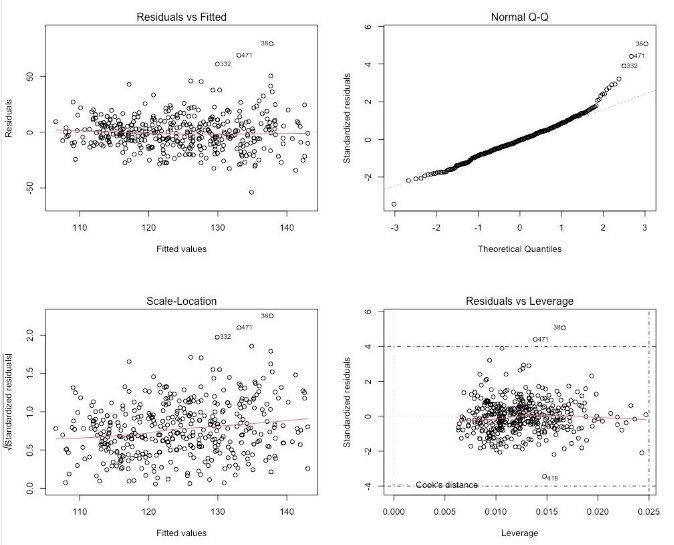

## Introduction

Hypertension is the most significant risk factor for cardiovascular disease and mortality [1]. Although there is evidence showing that cardiovascular disease is common among older people [2], it is crucial to explore those human body factors that can influence blood pressure to prevent cardiovascular disease through control of blood pressure. 

Therefore, the study aims to identify what factors are significantly associated with the combined systolic blood pressure reading by building a linear regression model, and to investigate whether there is an association between smoking and blood pressure.

## Study Methods

This study was conducted using health and nutrition survey data from the 2011-2012 US National Center for Health Statistics (NCHS). Data from 400 participants focused on 16 variables (Excluding ID) for people over 17 years old were used in analyses, and 343 participants' data were used as testing data for model accuracy. 

### Model Setup

A multiple regression model with 16 predictors was first built for primary prediction and variance inflation factor check. To avoid the effect of multicollinearity brought by height, weight, and total annual gross income for the household model, a reduced multiple linear regression model with 13 predictors was developed for further analysis (Appendix 1). 

### Variable Selection

Stepwise based on AIC, stepwise based on BIC, and LASSO shrinkage methods were used to select the best fit predictors of a prediction model. 

### Model Validation

Cross-validation calibration plots and the statistic calculation tables were used to check model prediction accuracy. The model with highest adjusted R2, smallest AIC, AICc, BIC values and prediction error will be selected as the final model. 

### Explortory Data Analysis(EDA)

A side-by-side boxplot of smoking and blood pressure was conducted to determine the association between smoking and blood pressure (Figure 5). Furthermore, smoking was added to the final model to provide further evidence of how smoking affects blood pressure. 

#### Model Diagnostic Check

The homoscedasticity and linearity assumptions were checked to see any systematic pattern in model diagnostic plots (Figure 3). The normality assumption was checked by seeing whether there was an apparent deviation from the normal line using a normal QQ- plot. Cook distance, DFFITS and DFBETAS were used to detect any influential points and outliers. The non-linearity will be diagnosed using the box-cox transformation method. The small number of influential points or bad leverage points will be removed, and the linear model will be refitted without them. When many influential points or bad leverage points appear, fitting a different regression model will be necessary. A small number of outliers will be counted as model limitations. 

## Results



Although the model selected by stepwise AIC does not have the lowest BIC values, it has the lowest prediction error (258.99), highest adjusted R2 (0.23) and smallest AIC (2208)(Figure 1). Additionally, stepwise based on the AIC model fits the ideal line best comparing the other two models (Figure 2). Therefore, it is the best model with three predictors: gender, age, and poverty ratio. 




 

The normality assumption is met. Most of the standardized residuals are on the normal line. Although a small part of standard residuals deviates from the line, they are not crazy (Figure 3). 

The homoscedasticity assumption is met, and the residuals neither spread out nor spread as fitted values increase. 

Since there are no particular patterns in the model diagnostic plot (Figure 3, Appendix 2), the errors are independent, and linearity is met (Figure 3). 

No assumptions are violated seriously, and no transformation is necessary for model. The dashed vertical line is the usual cut-off for high leverage point (i.e $2 *  \frac{p+1}{n}= 0.025$), the cook distance method did not detect any influential points, and two outliers were detected (Figure 3 d). 



Participants’ gender and age were significantly associated with blood pressure (P-value < 0.05, Figure 4). Given all other predictors constant, males have 4.842 higher than females on blood pressure on average, and the average blood pressure increase by 0.502 for each unit increase in average age. In contrast, the poverty ratio with blood pressure (P-value > 0.05) is slightly significant, not as significant as age and gender. The model reveals that a 1 unit increase in the average poverty ratio will decrease blood pressure by 0.929. This implies that people with higher income might pay more attention to their blood pressure, while people with low income might seldom consider controlling their blood pressure. 



The model summarizes that the blood pressure of people who smoke have 0.08 higher than people who do not smoke on average with other predictors constant, the Side-by-Side boxplot and model P-value(> 0.5) imply there is no significant association between smoking and blood pressure because both blood pressures are centred at around 120. However, 50% of smokers are slightly lower than non-smokers’ (Figure 5). 

## Discussion

The model reveals the average of blood pressure will increase as average age increases. This is consistent with the prospective studies which have confirmed the causal pathway between age and blood pressure: prevalence of cardiovascular disease is mainly centred in older age, and an increase in age leads to increased risk for cardiovascular disease at a later age2. Hence, controlling blood pressure to prevent CVD is vital as age increases. 

The final model stressed the potential significance of gender differences in blood pressure by showing that males have a higher blood pressure than females on average, with other body conditions constant. This is consistent with the fact that mortality of CVD in men will be higher than in women3. 

In a recent report, there is only a little evidence showing that smoking leads to a temporary rise in blood pressure4, while the final model showed smoking had no significant effect on blood pressure. Therefore, further analysis of smoking effect on blood pressure is necessary. 

The poverty ratio was reported to have a slight significant effect on blood pressure from the model. People with higher income tend to have lower blood pressure, whereas lower-income people tend to suffer from blood pressure problems. 

### Limitation 

- Although the stepwise method for variable selection helps overcome the issue of changing statistical significance and explaining the conditional nature of the model, it heavily depends on data and results in larger F statistics, which increase Type I error. 
- The Cook distance method did not detect any influential points. However, the DFFITS and DBETAS methods detected over ten influential points, which might influence the model's prediction accuracy. 
- Though the final model has the lowest prediction error compared with the other two candidate models, the prediction error, in general, is still too large, which might lead to a deviation in the model prediction. 

In conclusion, the model's findings suggest the need for further research to understand better the factors (i.e., Smoking) affecting blood pressure to tailor strategies to decrease CVD mortality. Furthermore, the public should be more aware of heart disease based on the influential factors of blood pressure. 

## Appendix





## References

1. Wu, C.-Y., Hu, H.-Y., Chou, Y.-J., Huang, N., Chou, Y.-C., & Li, C.-P. (2015). High Blood Pressure and All-Cause and Cardiovascular Disease Mortalities in Community-Dwelling Older Adults. *Medicine*, *94*(47), e2160. https://doi.org/10.1097/MD.0000000000002160 

2. Oliveros, E., Patel, H., Kyung, S., Fugar, S., Goldberg, A., Madan, N., & Williams, K. A. (2020). Hypertension in older adults: Assessment, management, and challenges. *Clinical Cardiology*, *43*(2), 99– 107. https://doi.org/10.1002/clc.23303 

3. Bots, S. H., Peters, S. A. E., & Woodward, M. (2017). Sex differences in coronary heart disease and stroke mortality: A global assessment of the effect of ageing between 1980 and 2010. *BMJ Global Health*, *2*(2), e000298. https://doi.org/10.1136/bmjgh-2017-000298 

4. Lan, R., Bulsara, M. K., Pant, P. D., & Wallace, H. J. (2021). Relationship between cigarette smoking and blood pressure in adults in Nepal: A population-based cross-sectional study. *PLOS Global Public Health*, *1*(11), e0000045. https://doi.org/10.1371/journal.pgph.0000045 

